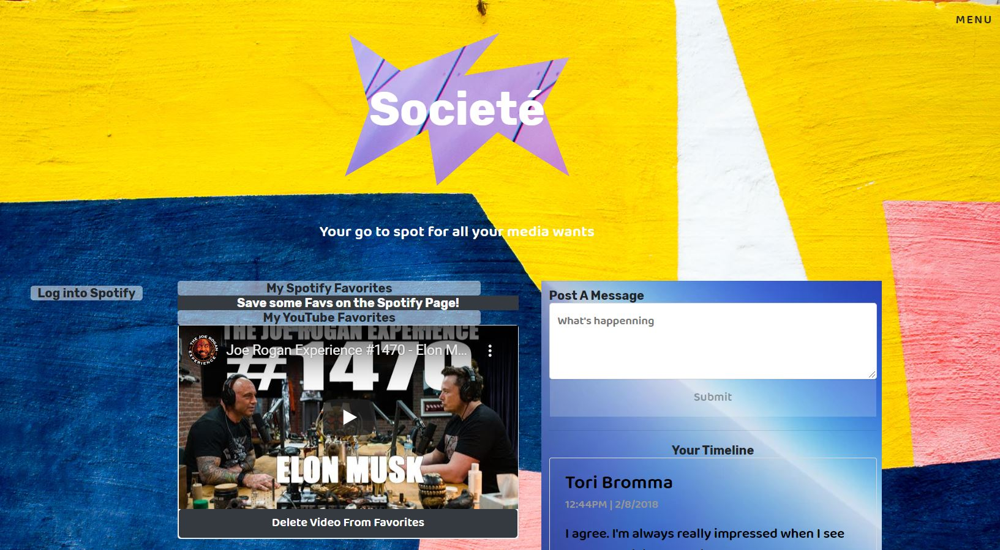

# Societé (Project3-Team Covid)
-------------------------------------------

Here's a link to the deployed page through Herkou:  
https://polar-brushlands-16053.herokuapp.com/youtubePage

-------------------------------------------

Our Project links together the vast source of music, podcasts and entertainment of Spotify with the ever growing expanse of media that is YouTube. Then sprinkles in a bit of a Twitter-esque messaging system to allow the user to talk about music and videos they find from the two API's and save their favorites within their profile to a personal homepage.
  

Team Members: 
- Tori Bromma 
- Jason Blake 
- Mafry Rivera 
- Ammar Alazzawi 
- Brian Hernandez 
